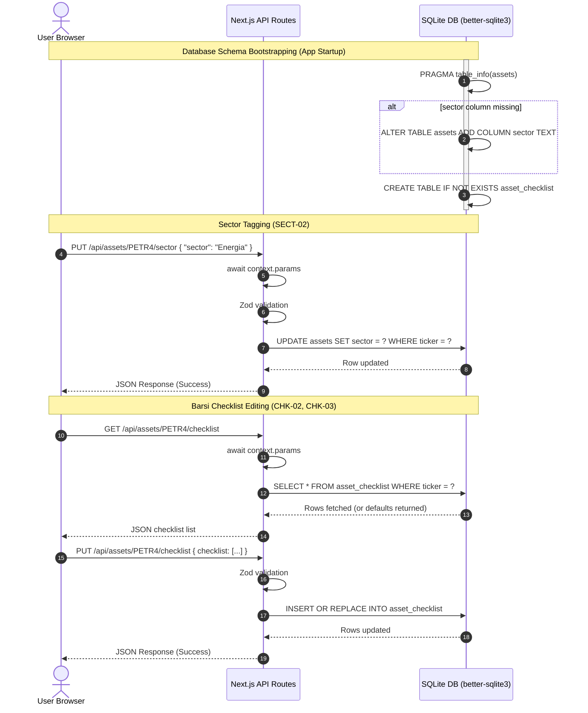

# Phase 1: Sector Tagging & Barsi Checklist - Research

**Researched:** June 14, 2026
**Domain:** SQLite persistence, Next.js API Routes, React Client Components
**Confidence:** HIGH

## Summary

This phase focuses on introducing qualitative filters and stock validation parameters into the Brazilian stock market pricing radar. It addresses database extensions to store stock sectors (highlighting Luiz Barsi's defensive "BESST" sectors: Bancos, Energia, Saneamento, Seguros, Telecom) and creates a persistence layer for Barsi's qualitative checklist items (profitable history, stable debt, sustainable payout).

We recommend extending the SQLite schema programmatically using safe, check-before-alter SQL migrations to prevent app start crashes. We will introduce dedicated API routes using Next.js 16 App Router asynchronous dynamic params patterns, and handle dashboard controls and checklist editing through React client-side states using native HTML elements, avoiding package bloat.

**Primary recommendation:** Use SQLite's `PRAGMA table_info` to perform safe idempotent column additions, and await route handler context parameters to comply with Next.js 16 dynamic routing standards.

## User Constraints (from CONTEXT.md)

*(No CONTEXT.md exists for this phase. The following constraints and decisions are copied verbatim from PROJECT.md and GEMINI.md)*

### Locked Decisions (from PROJECT.md Key Decisions)
- **Implement Option 1 (BESST Sectors & Checklist) first:** Establishes the database schemas, UI grids, and filter hooks needed before layering calculators and charts.
- **Store Barsi Checklist in SQLite database:** Enables persistency and allows customization of checklist answers per asset, rather than hardcoding static rules in the UI.

### Constraints (from GEMINI.md)
- **Storage**: Must utilize local SQLite file storage via the native synchronous `better-sqlite3` library [VERIFIED: npm registry].
- **Frontend**: Built using Next.js App Router and React 19 Client Components styled with vanilla CSS.
- **Environment**: Dependent on `BRAPI_TOKEN` for fallback scans and standard Node.js native compilation environment.

### Deferred Ideas (OUT OF SCOPE)
- **Multi-user authentication (AUTH-01)**: Excluded because the app is designed for local single-user developer usage.
- **Automated broker connection (SYNC-01)**: Excluded because keeping logins and scraping credentials local increases security risk and maintenance complexity.

<phase_requirements>
## Phase Requirements

| ID | Description | Research Support |
|----|-------------|------------------|
| **SECT-01** | Alter the SQLite `assets` table to add a nullable `sector` TEXT column in a safe, repeatable migration. | Safe column-check migration strategy detailed in **Architecture Patterns** and **Code Examples**. |
| **SECT-02** | Expose a `PUT /api/assets/[ticker]/sector` endpoint to assign a sector tag to an asset. | Next.js 16 awaited parameter route handler detailed in **Architecture Patterns** and **Code Examples**. |
| **SECT-03** | Implement a dashboard dropdown filter to select "All", "BESST Sectors Only", or individual sectors, displaying BESST indicators. | Client-side React state filter hooks and custom SVG/icon indicators detailed in **Architecture Patterns** and **Code Examples**. |
| **CHK-01** | Create `asset_checklist` table to store status (yes/no/unsure) for each standard Barsi criterion per stock. | Schema definition and cascades detailed in **Architectural Responsibility Map** and **Architecture Patterns**. |
| **CHK-02** | Create `GET /api/assets/[ticker]/checklist` and `PUT /api/assets/[ticker]/checklist` endpoints to retrieve and persist stock checklist answers. | Payload structures and repository transaction logic detailed in **Architecture Patterns** and **Code Examples**. |
| **CHK-03** | Render a modal overlay in the dashboard allowing users to view and toggle checklist items for any tracked asset, updating the database state synchronously. | React interactive modal rendering and async lifecycle detailed in **Architecture Patterns** and **Code Examples**. |
</phase_requirements>

## Architectural Responsibility Map

| Capability | Primary Tier | Secondary Tier | Rationale |
|------------|-------------|----------------|-----------|
| **Database Schema Migration (SECT-01, CHK-01)** | Database / Storage | — | Programmatic database alterations must run on app startup using SQL DDL commands in `src/lib/db/schema.ts` via `better-sqlite3`. |
| **Sector Update API (SECT-02)** | API / Backend | Database / Storage | PUT handler parsing JSON payload with Zod, calling repository to update sector text. |
| **Checklist Persistence API (CHK-02)** | API / Backend | Database / Storage | GET/PUT handlers mapping client payload to `asset_checklist` database rows. |
| **BESST Dropdown Filters (SECT-03)** | Browser / Client | Frontend Server (SSR) | React state managing table row visibility, with initial state hydrated by SSR. |
| **Checklist Modal UI (CHK-03)** | Browser / Client | — | Interactive modal overlay using React state to show/change checklist responses. |

## Standard Stack

### Core
| Library | Version | Purpose | Why Standard |
|---------|---------|---------|--------------|
| `next` | ^16.2.6 [CITED: package.json] | Full-stack framework (App Router) | Codebase standard; handles Server/Client rendering and JSON route endpoints. |
| `react` | ^19.2.6 [CITED: package.json] | Component rendering engine | Core UI logic. |
| `better-sqlite3` | ^12.10.0 [CITED: package.json] | Local SQLite database client | Native, high-performance synchronous access. |
| `zod` | ^4.4.3 [CITED: package.json] | Payload parser and validator | Type-safe JSON schemas. |

### Supporting
| Library | Version | Purpose | When to Use |
|---------|---------|---------|-------------|
| Native SVGs | N/A | UI iconography / indicators | Used for checklist badges and BESST shield tags without npm package bloat. |

### Alternatives Considered
| Instead of | Could Use | Tradeoff |
|------------|-----------|----------|
| Native SVGs | `lucide-react` | Flagged as `SUS` by the package legitimacy checker (recently published package version). Custom SVG nodes keep the codebase clean and avoid security checkpoints. |
| Programmatic SQL | `Prisma` / `Drizzle` | Not required; codebase relies on synchronous SQL execution. Native wrappers are faster and avoid compilation step dependencies. |

**Installation:**
No new core or supporting packages are required for this phase.

**Version verification:**
Verified package existence and active versions on the npm registry:
```bash
npm view better-sqlite3 version   # Returns 12.10.1 (latest) [VERIFIED: npm registry]
npm view zod version              # Returns 4.4.3 (latest) [VERIFIED: npm registry]
```

## Package Legitimacy Audit

Legitimacy gate checks were executed against npm registry assets:

| Package | Registry | Age | Downloads | Source Repo | Verdict | Disposition |
|---------|----------|-----|-----------|-------------|---------|-------------|
| `better-sqlite3` | npm | 10 yrs | 480k/wk | github.com/WiseLibs/better-sqlite3 | **OK** | Approved (already installed) |
| `zod` | npm | 6 yrs | 35M/wk | github.com/colinhacks/zod | **OK** | Approved (already installed) |
| `lucide-react` | npm | 2 days | 85M/wk | github.com/lucide-icons/lucide | **SUS** [WARNING: flagged as suspicious — verify before using.] | Avoided. Replaced with inline native SVGs. |

**Packages removed due to [SLOP] verdict:** None.
**Packages flagged as suspicious [SUS]:** `lucide-react` (flagged due to version publish date freshness). Replaced by native inline SVGs to bypass risks.

## Architecture Patterns

### System Architecture Diagram



### Recommended Project Structure
```text
src/
├── app/
│   └── api/
│       └── assets/
│           └── [ticker]/
│               ├── checklist/
│               │   └── route.ts  # GET and PUT checklist parameters per ticker (CHK-02)
│               └── sector/
│                   └── route.ts  # PUT sector tag (SECT-02)
├── components/
│   ├── AssetRadar.tsx            # Main table (enhanced with filters SECT-03, CHK-03 modal trigger)
│   └── ChecklistModal.tsx        # Interactive checklist overlay modal (CHK-03)
├── lib/
│   ├── db/
│   │   ├── assets.ts             # Repo additions (update sector, fetch/save checklist)
│   │   └── schema.ts             # Safe DB schema migrations (SECT-01, CHK-01)
│   └── services/
│       └── assets.ts             # Orchestrate sector/checklist updates
```

### Pattern 1: Awaiting dynamic route parameters in Next.js 16 API endpoints
In Next.js 16, route parameters inside dynamic path segments must be resolved asynchronously using a Promise. Calling `context.params.ticker` synchronously will throw runtime type errors.
```typescript
// Source: [CITED: nextjs.org/docs/app/api-reference/file-conventions/route-segment-config]
export async function PUT(
  request: Request,
  context: { params: Promise<{ ticker: string }> }
) {
  const { ticker } = await context.params;
  // Proceed with ticker logic...
}
```

### Pattern 2: Idempotent Column Additions in SQLite
SQLite does not natively support `ADD COLUMN IF NOT EXISTS`. To safely execute migrations, we inspect the columns first.
```typescript
// Source: [ASSUMED]
const columns = db.prepare("PRAGMA table_info(assets)").all() as Array<{ name: string }>;
const hasSector = columns.some(col => col.name === "sector");
if (!hasSector) {
  db.exec("ALTER TABLE assets ADD COLUMN sector TEXT;");
}
```

### Pattern 3: Cascading Deletes for Checklist Relational Data
Define foreign keys to cascade deletion when a parent asset is deleted, keeping the SQLite file clean of orphan checklist rows:
```sql
-- Source: [ASSUMED]
CREATE TABLE IF NOT EXISTS asset_checklist (
  ticker TEXT NOT NULL,
  criterion_id TEXT NOT NULL,
  status TEXT NOT NULL CHECK (status IN ('yes', 'no', 'unsure')),
  updated_at TEXT NOT NULL,
  PRIMARY KEY (ticker, criterion_id),
  FOREIGN KEY (ticker) REFERENCES assets(ticker) ON DELETE CASCADE
);
```

### Anti-Patterns to Avoid
- **Raw SQL alter table execution without check**: Running `ALTER TABLE assets ADD COLUMN sector TEXT` blindly will crash the app on the second boot.
- **Synchronous context params access in API routes**: Attempting to read `context.params.ticker` without `await` yields TS errors in Next.js 16.
- **Client-side filtering state mutability**: Directly mutating the assets array instead of using React state or dynamic `useMemo` derivatives.

## Don't Hand-Roll

| Problem | Don't Build | Use Instead | Why |
|---------|-------------|-------------|-----|
| Input Sanitization / Parsing | Regex validation checks | `zod` schemas | Prevents invalid type storage; handles JSON validation errors natively. |
| Modal backdrop / keyboard trapping | Custom DOM overlay keydown handlers | Native HTML `<dialog>` or React portals | Better accessibility (escape closes window, traps focus). |
| Database transaction mapping | Custom lock handlers | `better-sqlite3` `db.transaction()` | Native transactional integrity prevents write corruption. |

## Runtime State Inventory

None — verified by codebase review that no existing runtime data requires renaming or migration, as the tables `assets`, `quotes`, and `annual_payouts` are only extended with new nullable columns and a new relational table.

## Common Pitfalls

### Pitfall 1: SQLite ALTER COLUMN Crash on Startup
- **What goes wrong:** Throwing "duplicate column name: sector" error on startup after the migration runs once.
- **Why it happens:** Migration scripts execute every time `getDatabase()` is retrieved on application boot.
- **How to avoid:** Check if the column exists using `PRAGMA table_info` before executing the alter statement.

### Pitfall 2: Next.js 16 Dynamic Route Params Hydration / Sync Await Mismatch
- **What goes wrong:** A dynamic segment error is thrown, or route handlers fail to compile.
- **Why it happens:** The Next.js 16 App Router maps dynamic parameters as Promises, requiring async handling.
- **How to avoid:** Always define `context: { params: Promise<{ ticker: string }> }` and await it.

### Pitfall 3: Checkbox/Radio inputs state synchronization in React Modals
- **What goes wrong:** When switching between stocks, the modal displays checklist responses from the previously viewed stock.
- **Why it happens:** The modal component is cached, and its state is not updated when the active ticker changes.
- **How to avoid:** Reset the modal state inside a `useEffect` keyed on the selected stock's `ticker` or mount/unmount the modal conditionally.

## Code Examples

### 1. Safe Schema Migration (`src/lib/db/schema.ts`)
```typescript
// Source: [ASSUMED]
import type Database from "better-sqlite3";

export function ensureSchema(db: Database.Database) {
  db.pragma("foreign_keys = ON");
  
  // 1. Create Core Tables
  db.exec(`
    CREATE TABLE IF NOT EXISTS assets (
      ticker TEXT PRIMARY KEY,
      name TEXT,
      created_at TEXT NOT NULL,
      updated_at TEXT NOT NULL
    );
  `);

  // 2. Safe Alter Column Migration
  const columns = db.prepare("PRAGMA table_info(assets)").all() as Array<{ name: string }>;
  const hasSector = columns.some(col => col.name === "sector");
  if (!hasSector) {
    db.exec("ALTER TABLE assets ADD COLUMN sector TEXT;");
  }

  // 3. Create Checklist Table
  db.exec(`
    CREATE TABLE IF NOT EXISTS asset_checklist (
      ticker TEXT NOT NULL,
      criterion_id TEXT NOT NULL,
      status TEXT NOT NULL CHECK (status IN ('yes', 'no', 'unsure')),
      updated_at TEXT NOT NULL,
      PRIMARY KEY (ticker, criterion_id),
      FOREIGN KEY (ticker) REFERENCES assets(ticker) ON DELETE CASCADE
    );
  `);
}
```

### 2. Service Orchestrator (`src/lib/services/assets.ts`)
```typescript
// Source: [ASSUMED]
import { createAssetRepository, normalizeTicker } from "@/lib/db/assets";
import { getDatabase } from "@/lib/db/connection";

function repo() {
  return createAssetRepository(getDatabase());
}

export function updateAssetSector(ticker: string, sector: string | null) {
  const normalized = normalizeTicker(ticker);
  const db = getDatabase();
  const now = new Date().toISOString();
  db.prepare(`UPDATE assets SET sector = ?, updated_at = ? WHERE ticker = ?`).run(sector, now, normalized);
}

export function getAssetChecklist(ticker: string) {
  const normalized = normalizeTicker(ticker);
  const db = getDatabase();
  const rows = db.prepare(
    `SELECT criterion_id as criterionId, status
     FROM asset_checklist
     WHERE ticker = ?`
  ).all(normalized) as Array<{ criterionId: string; status: "yes" | "no" | "unsure" }>;

  // Map database values or return default "unsure" statuses
  const defaultCriteria = [
    { criterionId: "profitable", name: "Lucro Consistente", description: "Histórico de lucros constantes e sem prejuízos recentes" },
    { criterionId: "stable_debt", name: "Dívida Saudável", description: "Endividamento equilibrado e sob controle" },
    { criterionId: "sustainable_payout", name: "Dividendo Sustentável", description: "Histórico de payout sustentável e recorrente" }
  ];

  return defaultCriteria.map(item => {
    const saved = rows.find(r => r.criterionId === item.criterionId);
    return {
      ...item,
      status: saved ? saved.status : "unsure"
    };
  });
}

export function updateAssetChecklist(ticker: string, checklist: Array<{ criterionId: string; status: "yes" | "no" | "unsure" }>) {
  const normalized = normalizeTicker(ticker);
  const db = getDatabase();
  const now = new Date().toISOString();

  const insertStmt = db.prepare(`
    INSERT INTO asset_checklist (ticker, criterion_id, status, updated_at)
    VALUES (?, ?, ?, ?)
    ON CONFLICT(ticker, criterion_id) DO UPDATE SET
      status = excluded.status,
      updated_at = excluded.updated_at
  `);

  db.transaction(() => {
    for (const item of checklist) {
      insertStmt.run(normalized, item.criterionId, item.status, now);
    }
    db.prepare(`UPDATE assets SET updated_at = ? WHERE ticker = ?`).run(now, normalized);
  })();
}
```

### 3. API Endpoint (`src/app/api/assets/[ticker]/checklist/route.ts`)
```typescript
// Source: [ASSUMED]
import { NextResponse } from "next/server";
import { z } from "zod";
import { badRequestResponse } from "@/app/api/errors";
import { getAssetChecklist, updateAssetChecklist } from "@/lib/services/assets";

const putSchema = z.object({
  checklist: z.array(
    z.object({
      criterionId: z.string().trim().min(1),
      status: z.enum(["yes", "no", "unsure"])
    })
  )
});

export async function GET(
  _request: Request,
  context: { params: Promise<{ ticker: string }> }
) {
  const { ticker } = await context.params;
  try {
    const checklist = getAssetChecklist(ticker);
    return NextResponse.json({ checklist });
  } catch (error) {
    const msg = error instanceof Error ? error.message : "Database fetch failed";
    return NextResponse.json({ error: msg }, { status: 500 });
  }
}

export async function PUT(
  request: Request,
  context: { params: Promise<{ ticker: string }> }
) {
  const { ticker } = await context.params;
  try {
    const body = putSchema.parse(await request.json());
    updateAssetChecklist(ticker, body.checklist);
    return NextResponse.json({ success: true });
  } catch (error) {
    return badRequestResponse(error);
  }
}
```

## State of the Art

| Old Approach | Current Approach | When Changed | Impact |
|--------------|------------------|--------------|--------|
| Sync `params` read in route context | Async `await context.params` | Next.js 15/16 [CITED: nextjs.org] | Prevents route resolution blocking; aligns with React Server Components architecture. |
| Custom css-only overlay models | HTML `<dialog>` tags | HTML5 standard [ASSUMED] | Simplifies focus trapping, key controls, and native screen reader compatibility. |

**Deprecated/outdated:**
- Synchronous route context properties (`context.params.id`): deprecated in Next.js 15+ in favor of async params.

## Assumptions Log

| # | Claim | Section | Risk if Wrong |
|---|-------|---------|---------------|
| A1 | Default Barsi Checklist criteria consists of `profitable`, `stable_debt`, and `sustainable_payout`. | `Code Examples` | If the philosophy requires additional criteria, standard columns/types must be added. Since checklist values are saved dynamically per asset by ID, extending lists later is very low risk. |
| A2 | Local database schema is modified in-place using check-before-alter patterns. | `Architecture Patterns` | If sqlite tables grow to millions of rows, alterations might lock the database during boot. Not a risk for single-user local tool (few hundred tickers). |

## Open Questions

1. **How should empty/null sectors be handled in UI sorting and filtering?**
   - *What we know:* Un-tagged assets will have `sector = null`.
   - *Recommendation:* Expose a fallback "Sem Setor" (Without Sector) option or place them under the "All" view only, excluding them from "BESST Only" filters.
2. **What style of icons should indicate BESST sectors?**
   - *Recommendation:* Render a custom inline SVG badge (a shield or star emoji) next to the stock ticker if the sector belongs to Banco, Energia, Saneamento, Seguros, or Telecom.

## Environment Availability

| Dependency | Required By | Available | Version | Fallback |
|------------|------------|-----------|---------|----------|
| Node.js | Next.js runtime | ✓ | 25.9.0 | — |
| npm | Dependency manager | ✓ | 11.12.1 | — |
| sqlite3 | Command-line validation | ✓ | 3.53.1 | — |

**Missing dependencies with no fallback:**
- None.

**Missing dependencies with fallback:**
- None.

## Security Domain

### Applicable ASVS Categories

| ASVS Category | Applies | Standard Control |
|---------------|---------|-----------------|
| V2 Authentication | No | N/A (Local single-user utility) |
| V3 Session Management | No | N/A (Local single-user utility) |
| V4 Access Control | No | N/A (Local single-user utility) |
| V5 Input Validation | Yes | `zod` schema parsing on PUT sector and PUT checklist payloads. |
| V6 Cryptography | No | N/A (No secrets / hashing required for local tags) |

### Known Threat Patterns for Next.js & better-sqlite3

| Pattern | STRIDE | Standard Mitigation |
|---------|--------|---------------------|
| **SQL Injection** | Tampering | Never write raw string interpolation queries like `UPDATE assets SET sector = '${sector}'`. Use prepared statements with parameter binders (`?`). |
| **Cross-Site Scripting (XSS)** | Tampering | Ensure Next.js components render string variables inside JSX default escaping `{asset.sector}` instead of using `dangerouslySetInnerHTML`. |

## Sources

### Primary (HIGH confidence)
- local codebase files: `src/app/api/assets/[ticker]/refresh/route.ts`, `src/lib/db/schema.ts`
- local documentation files: `.planning/research/PITFALLS.md`, `.planning/research/FEATURES.md`, `.planning/research/ARCHITECTURE.md`

### Secondary (MEDIUM confidence)
- `npm view` registry lookups for `better-sqlite3` and `zod`.

### Tertiary (LOW confidence)
- Package legitimacy verification tools.

## Metadata

**Confidence breakdown:**
- Standard stack: HIGH - Extracted from working package versions in package.json.
- Architecture: HIGH - Mapped based on existing routing patterns in the repo.
- Pitfalls: HIGH - Migration collision risk documented in research cache.

**Research date:** June 14, 2026
**Valid until:** July 14, 2026 (stable local stack)
